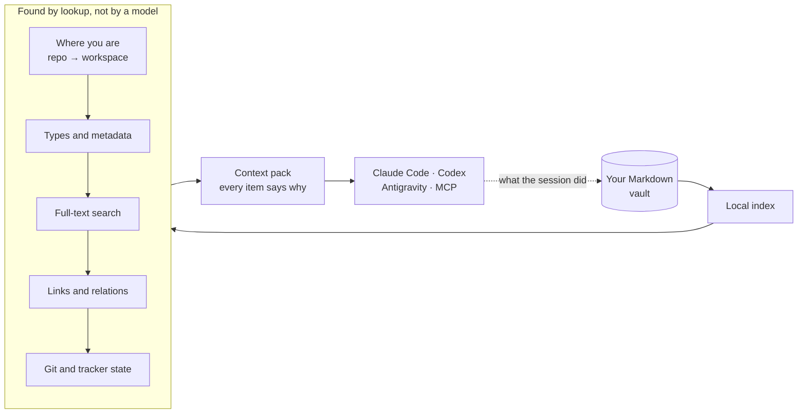

<p align="center">
  
</p>

<p align="center">
  <a href="https://github.com/BezaCore-Labs/never4ga/actions/workflows/gate.yml"></a>
  <a href="https://github.com/BezaCore-Labs/never4ga/blob/main/LICENSE"></a>
</p>

Never4gA, short for *never forget again*, is memory for you and every AI agent you
work with. It keeps your notes, decisions and project history as plain Markdown on
your machine, and hands each agent session exactly the part it needs before the
session starts.

> **Early days.** This is version 0.1, in daily use by the person who built it
> and new to everyone else. Expect rough edges and interfaces that still move,
> and [tell us](#tell-us-where-its-wrong) when you hit one.

**It does that without a model.** Finding the right context is lookups, queries and
file reads, so it costs no tokens, takes seconds, and gives the same answer every
time. Your agent spends its budget on the work, not on searching for what it should
already know.

<p align="center">
  
</p>

## Why it's built this way

Most agent memory asks a model to decide what's relevant, or lets the agent go
looking with its own tool calls. Both spend tokens and turns before any work
happens. Never4gA does that part first, mechanically:

- **Fewer tokens.** In the vault it was built in, 2,153 files and about 3 million
  tokens of notes, a session starts with a pack of about 10,000 tokens. That's
  what the agent reads. Nothing else is loaded.
- **Faster starts.** That pack is assembled in about four seconds, including live
  Git and tracker state, with zero model calls.
- **You can see why.** Every item in a pack names the reason it was included. The
  same question gets the same pack.

## What it does

| | |
|---|---|
| **Remembers across sessions** | Each session opens with what the project is, the rules it follows, what was decided, and what the last session left open. |
| **Remembers across tools** | Claude Code, Codex, Antigravity and any MCP client read the same memory. Switch tools and nothing is lost. |
| **Writes back what happened** | Sessions record progress and decisions as dated logs, so the next one picks up where this one stopped. |
| **Keeps your notes yours** | Everything is Markdown in a normal Obsidian vault. Uninstall Never4gA and your notes are exactly as they were. |
| **Starts from the notes you have** | Point it at an existing folder. Your files stay where they are, and your notes are searchable on the first run. |
| **Brings in your tracker** | Open work items from OpenProject join the pack, and a session can update them. |

## How it works



A pack is built in stages, and each stage is a query: which workspace this
repository belongs to, which documents that workspace holds, what full-text search
finds, what those documents link to, and what Git and your tracker say right now.
A pack never grows past its budget. A model gets involved when you ask for
judgment, and never for work a lookup can do.

**In Obsidian:** the [Never4gA Companion](https://github.com/BezaCore-Labs/never4ga-obsidian)
plugin shows the same pack beside the note you're reading, with the reason each
item is there. Install it from its
[latest release](https://github.com/BezaCore-Labs/never4ga-obsidian/releases/latest)
or with BRAT; it isn't in Obsidian's community plugin list yet.

<p align="center">
  
</p>

## Quick start

```bash
uv tool install never4ga
export NEVER4GA_VAULT=~/notes
```

[uv](https://docs.astral.sh/uv/) installs the Python version Never4gA needs if you
don't already have it.

```bash
never4ga init                        # a new vault, or around the notes already there
never4ga index
never4ga search "what we decided about auth"
```

Then connect a project and your agents:

```bash
cd ~/code/my-project
never4ga workspace create "My Project" --type project
never4ga workspace map <workspace-id>
never4ga adapters sync --apply --repositories   # skills, and this repository's pointer files
never4ga adapters mcp --apply                    # the MCP server
```

`adapters sync --apply` on its own only updates your agents. `--repositories`
also writes a small pointer file into each mapped repository, ignored by Git, so
agents working there know to ask Never4gA for context.

Your next agent session in that repository starts with its context pack.

## What it won't do

- **Call a model for you.** It has no API key and never meters your usage. You
  bring the AI tools you already pay for.
- **Send your notes anywhere.** Everything runs on your machine, and the service
  only listens on localhost.
- **Take over your files.** The index is disposable and rebuilt from your Markdown.
  Your files are the only source of truth, and nothing is committed to Git for you.

<details>
<summary><b>Good to know</b></summary>

- **Context packs follow repositories.** A workspace is attached to a Git
  repository, and a pack is built for the repository you're in. Notes that aren't
  tied to one are fully searchable but don't get a pack yet.
- **Platforms.** Built and tested on Linux, where the background service runs
  under systemd. On macOS and Windows, run `never4ga serve` in a terminal instead.
- **Four ways in.** The `never4ga` CLI, an MCP server (`never4ga-mcp`), a local
  HTTP API, and the [Obsidian companion](https://github.com/BezaCore-Labs/never4ga-obsidian).
  All four run the same code.

</details>

## Tell us where it's wrong

If something didn't make sense, or didn't work the way this page says it does,
[open an issue](https://github.com/BezaCore-Labs/never4ga/issues). That's the most
useful thing you can send.

GitHub is Never4gA's only public home. Issues and pull requests go there.
To report a security problem, see [SECURITY.md](https://github.com/BezaCore-Labs/never4ga/blob/main/SECURITY.md) rather than
opening an issue.

## Working on Never4gA

The design is written down. [`docs/specs/`](https://github.com/BezaCore-Labs/never4ga/tree/main/docs/specs) holds the
specifications; start with
[`00-spec-index.md`](https://github.com/BezaCore-Labs/never4ga/blob/main/docs/specs/00-spec-index.md). They're generated from the
maintainer's notes, so propose a change in an issue rather than editing them.
[`AGENTS.md`](https://github.com/BezaCore-Labs/never4ga/blob/main/AGENTS.md) is the contract for AI agents working in this
repository, and a fair summary of the rules for people too.

```bash
uv venv --python 3.14 .venv
VIRTUAL_ENV=.venv uv pip install -e '.[dev]'
.venv/bin/ruff check . && .venv/bin/ruff format --check . && .venv/bin/mypy && .venv/bin/pytest
```

That last line is the gate, and every pull request runs it.

## License

[Apache License 2.0](https://github.com/BezaCore-Labs/never4ga/blob/main/LICENSE). Never4gA, by [BezaCore Labs](https://github.com/BezaCore-Labs).
